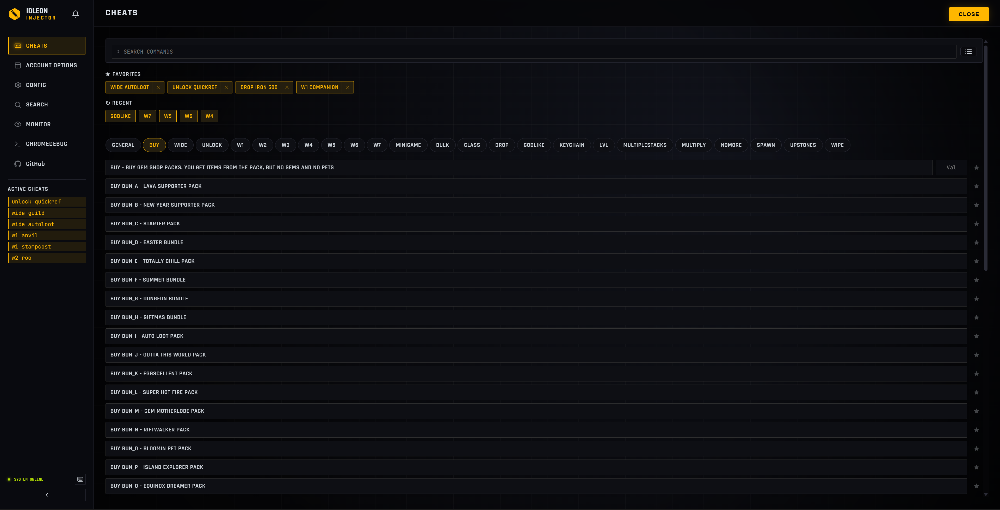

# Idleon Injector

Node.js + CDP runtime injector for **Legends of Idleon**. It targets
the Steam or web client and exposes a local [VanJS](https://vanjs.org/)
dashboard plus CLI for debugging, modding, and account management.

## Features

- **Steam/Web Injection**: Injects JavaScript into the Steam client or web
  session using a configurable Chromium-based browser profile.
- **Web Dashboard ([VanJS](https://vanjs.org/))**: Local UI at
  `http://localhost:8080` for cheats, state inspection, and DevTools.
- **Live State Sync**: WebSocket updates keep cheat state in sync without
  polling.
- **Value Monitor**: Track in-game values with history in the Web UI.
- **Account Management**: Update account parameters and game attributes in
  real time.
- **Config Editor**: Edit `cheatConfig`, `startupCheats`, and injector options
  with safe defaults and function helpers.
- **Cross-Platform**: Windows, Linux (Steam Proton), and macOS (web mode only).
- **Portable**: Runs from any directory; no game files modified.

## Installation

### Prerequisites

- **Steam (Steam mode)**: The Steam client must be running.
- **Legends of Idleon**: Installed via Steam or accessible in the web client.
- **Chromium-based browser (Web mode)**

### Steps

1. **Download**: Get the latest release from the [releases page](https://github.com/MrJoiny/Idleon-Injector/releases).
2. **Extract**: Unzip to any folder.
    - _Optional: place next to the game executable to use its bundled Chromium._
3. **Run**: Execute `InjectCheatsUI.exe`.
4. **Setup**: On first run, a CLI wizard guides you through:
    - Platform choice (Steam or Web).
    - Path setup (if needed).
    - In-Game UI Overlay toggle.
    - Creates `config.custom.js` automatically.

## Usage

1. Launch `InjectCheatsUI.exe`
2. Steam mode auto-launches the game; web mode launches the configured browser
   profile.
3. Once the game loads, you can interact via the **Web UI** or the **Console**.

## Cheat List

- [Project Wiki Cheat List](https://github.com/MrJoiny/Idleon-Injector/wiki) - Full cheat command list for quick lookup.

### Web Interface

The recommended way to interact is via the [VanJS](https://vanjs.org/)-powered Web UI.



- **URL**: [http://localhost:8080](http://localhost:8080)
- **Capabilities**:
    - Toggle cheats on/off.
    - View active cheat status.
    - Modify account configs.
    - Monitor specific game values (manual path or from Search).
    - Access Chrome DevTools.
    - Apply config changes to RAM or save them to disk.

### Command Line

Type commands directly into the console window. Autocomplete is provided by the game runtime.

- Type `chromedebug` to open the DevTools URL.

## Configuration

The injector uses a hierarchical configuration system:

- `config.js`: Default settings (do not modify).
- `config.custom.js`: User overrides (optional).

The injector validates `config.custom.js` for type errors (e.g., string where a function is expected). Invalid settings are logged and reverted to defaults.

## Development

Tech stack: Node.js + CDP backend, [VanJS](https://vanjs.org/) + VanX web UI,
packaged with `pkg` (Node 18).

To build the injector from source:

```bash
# Install dependencies
npm install

# Build cheats bundle (required for start/build)
npm run build:cheats

# Run from source
npm run start

# Build for Windows
npm run build

# Build for Linux (output: InjectCheatsUI-linux)
npm run build-unix

# Build for macOS (Intel output: InjectCheatsUI-macos-x64)
npm run build-macos-x64

# Build for macOS (Apple Silicon output: InjectCheatsUI-macos-arm64)
npm run build-macos-arm64
```

Validation runs the standard checks:

```bash
npm run validate
```

## Cheat Development

See `docs/cheats.md` for how to write and register new cheats.

## Documentation

- [Backend Architecture](docs/backend.md) - Server, CDP, and module structure.
- [Build Guide](docs/build.md) - Building from source for all platforms.
- [Cheats Guide](docs/cheats.md) - Writing and registering cheats.
- [CLI Reference](docs/cli.md) - Console commands and autocomplete.
- [Configuration](docs/config.md) - Config files, schema, and validation.
- [Platforms](docs/platforms.md) - Steam, web, and OS-specific setup.
- [Web UI](docs/ui.md) - VanJS dashboard and components.

## Troubleshooting

- **Game doesn't start**: Ensure Steam is running.
- **Web target fails**: Verify `webUrl` and that a Chromium-based browser is available.
- **Linux users**: If auto-launch fails, use the launch options provided in the
  terminal output:
  `PROTON_LOG=1 PROTON_NO_ESYNC=1 WINEDBG=fixme %command% --remote-debugging-port=32123`

## Credits

- **iBelg**
- **Creater0822**
- **valleymon**
- **sciomachist**
- **and everyone that contributed to this project**

[](https://github.com/MrJoiny/Idleon-Injector/graphs/contributors)
